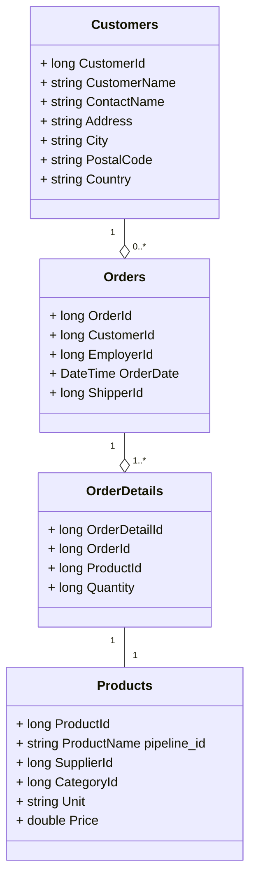

# YungChingHomework
- This project is only for interview.

## Data structure

```mermaid
classDiagram
    Customers "1" --o "0..*" Orders
    Orders "1" --o "1..*" OrderDetails
    OrderDetails "1" -- "1" Products 
    class Customers{
        + long CustomerId
        + string CustomerName
        + string ContactName
        + string Address
        + string City
        + string PostalCode
        + string Country
    }
    class Orders{
        + long OrderId
        + long CustomerId
        + long EmployerId
        + DateTime OrderDate
        + long ShipperId
    }
    class OrderDetails{
        + long OrderDetailId
        + long OrderId
        + long ProductId
        + long Quantity
    }
    class Products{
        + long ProductId
        + string ProductName pipeline_id
        + long SupplierId
        + long CategoryId
        + string Unit
        + double Price
    }
```